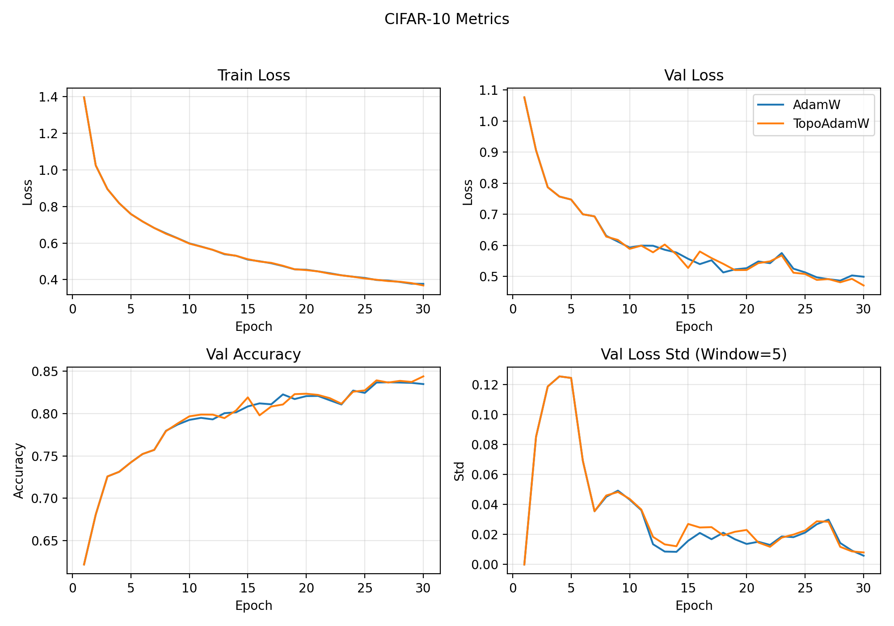

# TopoAdam: Topology-Guided Adaptive Optimizer 🌄

[](https://opensource.org/licenses/MIT)
[](https://www.python.org/downloads/)
[](https://pytorch.org/)

**TopoAdamW** is a PyTorch optimizer that automatically adapts learning rates based on the **geometric shape of your loss landscape** using Topological Data Analysis (TDA). It provides better convergence stability and generalization than standard AdamW optimizers.

## Why TopoAdamW?

Training neural networks with a fixed learning rate is like driving with cruise control on a mountain road. TopoAdamW acts as an intelligent co-pilot:

1. Topological awareness: probes local geometry (flatness/sharpness) of the loss landscape.
2. Dynamic adjustment: scales LR within [min_lr_ratio, max_lr_ratio] (defaults 0.2 to 1.0; raise max_lr_ratio to allow acceleration).
3. Safety lock: if center loss spikes above 2x EMA, a divergence brake overrides acceleration and reduces LR.

Result: faster convergence on smooth terrain, stable behavior on rough terrain.

## Performance (SOTA-Level Results)

We benchmarked TopoAdamW against standard AdamW on CIFAR-10 using a CifarNet architecture. Both optimizers used the same base learning rate (1e-3), weight decay (5e-4), and ran for 30 epochs.

The result: TopoAdamW achieved a +0.91% accuracy boost over AdamW, breaking past the late-epoch plateau.



### Benchmark Metrics

| Metric | AdamW (Baseline) | TopoAdamW (Ours) | Improvement |
| :--- | :--- | :--- | :--- |
| Test Accuracy | 83.49% | 84.40% | +0.91% |
| Final Val Loss | 0.4994 | 0.4713 | Better generalization |
| Late-Stage | Plateaued around ~0.50 | Continues improving to 0.4713 | Active adaptation |
| Overhead | ~12.2s / epoch | ~14.3s / epoch | ~17% increase |

> Observation: As shown in the graph, AdamW's loss curve flattens out near Epoch 20-25, while TopoAdamW continues to lower loss through the end of training.

## 🚀 Quick Start

### Installation

```bash
# Clone repository
git clone https://github.com/SVAH-X/topoadamw.git
cd topoadamw

# Install dependencies
pip install torch torchvision numpy gudhi
```

### Basic Usage

```python
import torch
import torch.optim as optim
from topoadamw import TopoAdamW

# Your model
model = YourModel()
criterion = torch.nn.CrossEntropyLoss()

# Create TopoAdamW optimizer (AdamW-compatible wrapper)
optimizer = TopoAdamW(model.parameters(), model, lr=1e-3, weight_decay=5e-4)

# Training loop
for data, target in train_loader:
    optimizer.zero_grad()
    output = model(data)
    loss = criterion(output, target)
    loss.backward()
    
    # Pass data, target, criterion for topology probing
    optimizer.step(data=data, target=target, criterion=criterion)
```

Defaults: lr=1e-3, weight_decay=5e-4, interval=50, warmup_steps=150, max_lr_ratio=1.0, min_lr_ratio=0.2.

**That's it!** TopoAdamW handles learning rate adaptation automatically.

### Advanced Configuration

```python
optimizer = TopoAdamW(
    model.parameters(),
    model,
    lr=1e-3,
    weight_decay=5e-4,
    interval=50,              # Probe landscape every 50 steps
    probe_kwargs={
        'grid_size': 15,      # Landscape resolution (15x15 grid)
        'span': 0.12          # Probing region size
    },
    max_lr_ratio=1.0,         # Cap LR at base value
    min_lr_ratio=0.2,         # Keep LR above 0.2x base value
    warmup_steps=150,         # No adjustment for first 150 steps
    verbose=True              # Print LR adjustments
)
```

## 🔬 How It Works

TopoAdam uses **Topological Data Analysis** to understand your loss landscape geometry:

1. **Probe** 🔍: Periodically samples the loss landscape around the current parameters
2. **Analyze** 📐: Extracts geometric features (sharpness, variance) using TDA
3. **Adapt** 🎯: Adjusts learning rate based on landscape topology

### Geometric Heuristics

| Landscape Type | Sharpness | Variance | LR Adjustment | Reason |
|----------------|-----------|----------|---------------|---------|
| Flat & Smooth | < 0.1 | < 0.3 | ×1.15 | Safe to accelerate |
| Very Sharp | > 0.5 | — | ×0.80 | Avoid overshooting |
| Moderately Sharp | > 0.2 | — | ×0.95 | Gentle slowdown |
| High Variance | — | > 0.5 | ×0.85 | Stabilize |
| Neutral | — | — | ×1.00 | Keep current LR |

## 📁 Repository Structure

```
topoadamw/
├── topoadamw/               # Main package
│   ├── __init__.py
│   ├── optimizer.py        # TopoAdam optimizer
│   ├── probe.py            # Loss landscape probing
│   └── tda_utils.py        # Topological analysis
├── examples/
│   ├── cifar10_example.py      # CIFAR-10 training
│   └── custom_model_example.py # Custom model usage
├── tests/
│   └── test_optimizer.py       # Unit tests
├── generate_comparison_plot.py # Reproduce benchmark
├── README.md
└── LICENSE
```

## 🧪 Reproducing Results

Generate the comparison plot yourself:

```bash
python generate_comparison_plot.py
```

This trains AdamW and TopoAdamW on CIFAR-10 and produces `comparison_results.png`.

Run unit tests:

```bash
python -m pytest tests/
# or
python tests/test_optimizer.py
```

## 💡 Examples

### CIFAR-10 Image Classification

```bash
python examples/cifar10_example.py
```

Trains a CNN on CIFAR-10 with full data augmentation and model checkpointing.

### Custom Model

```bash
python examples/custom_model_example.py
```

Shows how to use TopoAdamW with your own model architecture and dataset.

## ⚙️ Requirements

- **Python** ≥ 3.8
- **PyTorch** ≥ 2.0
- **NumPy** ≥ 1.20
- **GUDHI** (for TDA) - `pip install gudhi`

### Installing GUDHI

```bash
# Linux / macOS
pip install gudhi

# Windows (may require conda)
conda install -c conda-forge gudhi
```

## 🤝 Contributing

Contributions welcome! Areas for improvement:

- [ ] Support for more base optimizers (SGD, RMSprop)
- [ ] Adaptive probing intervals
- [ ] Multi-GPU / distributed training support
- [ ] Learned geometric heuristics
- [ ] Benchmark on larger models (ResNet, ViT, Transformers)

## 📖 Citation

If you use TopoAdam in your research, please cite:

```bibtex
@software{topoadamw2025,
  author = {Congkai Peng},
  title = {TopoAdam: Topology-Guided Adaptive Optimizer},
  year = {2025},
  publisher = {GitHub},
  url = {https://github.com/SVAH-X/topoadamw}
}
```

## 📚 References

This work builds on research in loss landscape visualization and topological data analysis:

- Li et al. "Visualizing the Loss Landscape of Neural Nets" (NeurIPS 2018)
- Carlsson, G. "Topology and Data" (AMS 2009)
- Filter normalization for loss landscape visualization

## 🐛 Known Issues / Limitations

- **GPU Memory**: Landscape probing requires additional forward passes. Reduce `probe_kwargs.grid_size` if memory is limited.
- **Overhead**: Adds ~5-10% training time overhead from periodic probing.
- **Small Batches**: Works best with batch size ≥ 32. Very small batches may have noisy landscapes.

## 📄 License

MIT License - see [LICENSE](LICENSE) file for details.

## 🙏 Acknowledgments

- Built on PyTorch's optimization framework
- Uses GUDHI library for topological computations
- Inspired by modern adaptive optimizer research

---

**Made with ❤️ for better deep learning**

⭐ **Star this repo** if you find it useful!  
🐛 **Report issues** on GitHub  
💬 **Questions?** Open a discussion


